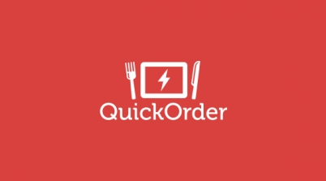
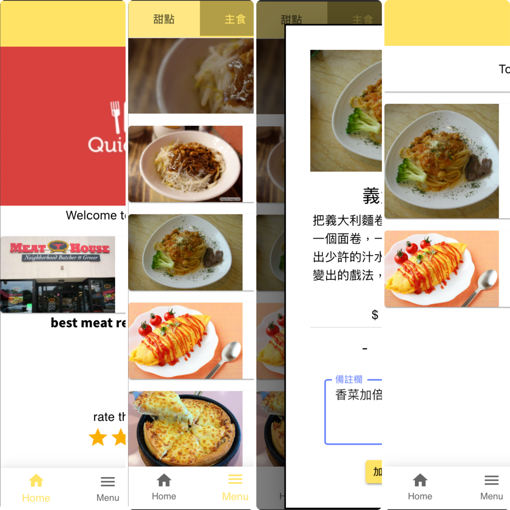
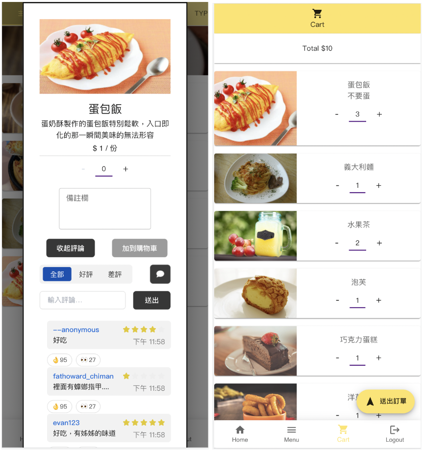

# Quick order 快點

Quick order是一個餐廳點餐系統，具有雙語介面，通過手機連上客戶端介面進行點餐，並送到後端伺服器，再由後端傳送點餐資料給廚房端介面進行餐點製作。(餐廳端前端介面與後端系統原始碼放置於 otherparts)

Team: 
- 顧客方前端: [@Howard Chi](https://github.com/howardon951), [@YuXiangLin](https://github.com/YuXiangLin1234), 我
- 餐廳方前端: [Max, Gao](https://github.com/Risetto-Kao), [a0932131603](https://github.com/a0932131603)
- 後端: [Ilya Konnov](https://github.com/konnovdev), [dsa66253](https://github.com/dsa66253)

## Available Scripts

In the project directory, you can run:

### `yarn start`

Runs the app in the development mode.\
Open [http://localhost:3000](http://localhost:3000) to view it in your browser.

The page will reload when you make changes.\
You may also see any lint errors in the console.

### `yarn test`

Launches the test runner in the interactive watch mode.\
See the section about [running tests](https://facebook.github.io/create-react-app/docs/running-tests) for more information.
